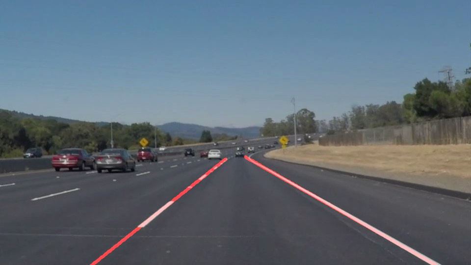
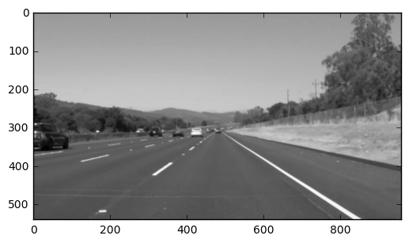
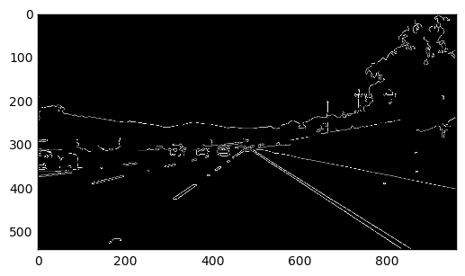
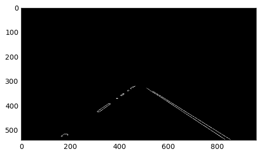
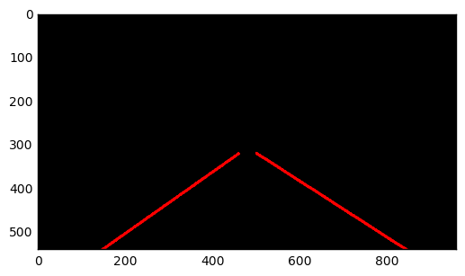
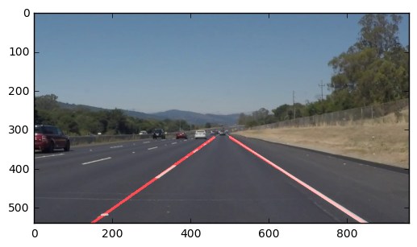
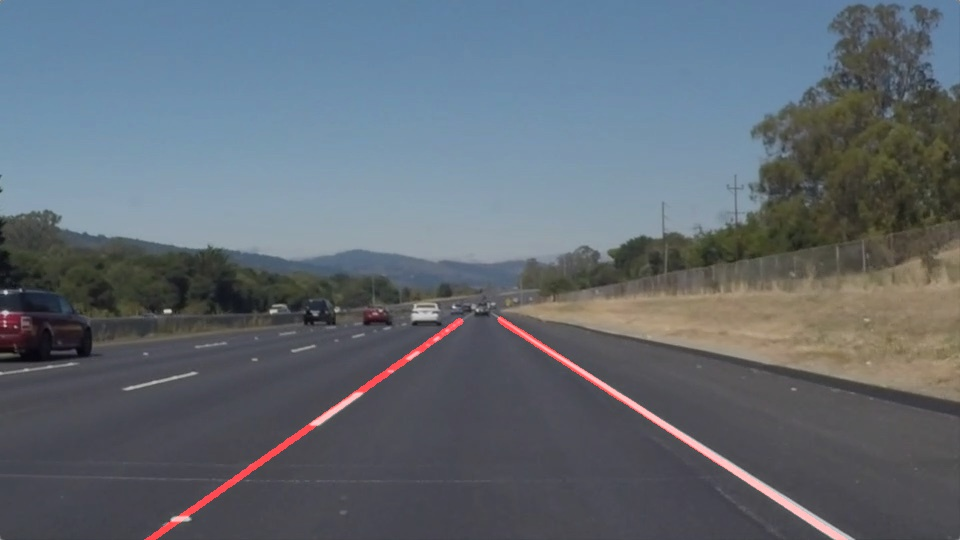
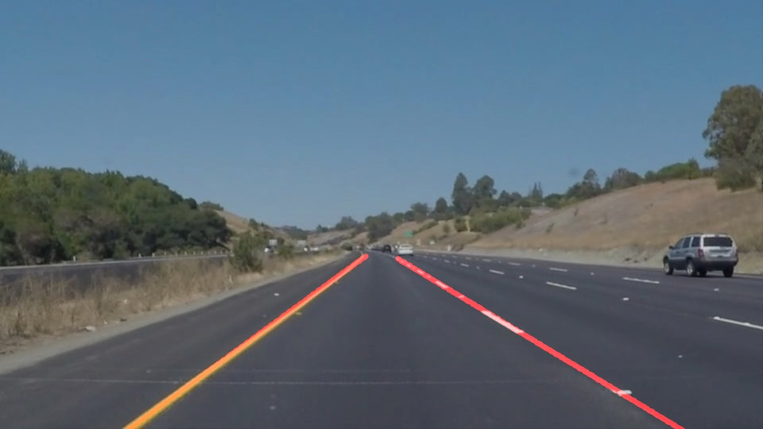
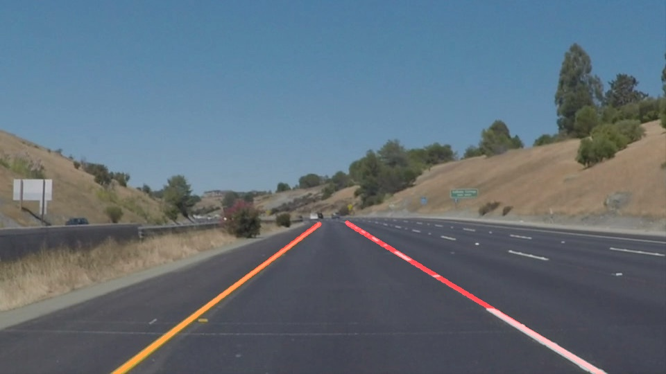
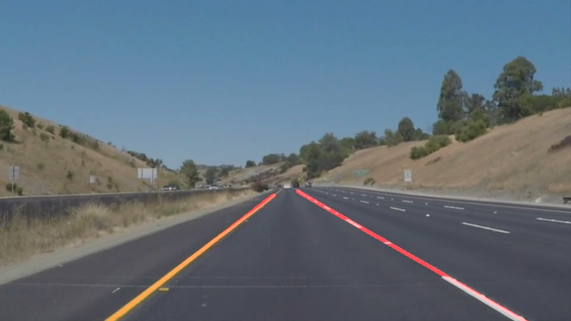

#**Finding Lane Lines on the Road** 

##Udacity Self Driving Course 

---

## 
You can run **Lane Line Finding** program in command line:

> python lane_detection.py

As an example it processes the following video files:

- 'challenge.mp4' -> 'extra.mp4'

- 'solidWhiteRight.mp4' -> 'white.mp4'

- 'solidYellowLeft.mp4' -> 'yellow.mp4'

You can also run iPython notebook **P1-Solution.ipynb**

### Reflection

###1. Pipeline description.

Original image:

Processed image:

My pipeline consisted of the following steps:
 
**1. Image conversion to *grayscale***
___________
> grayscale_image = self.grayscale(initial_image)

'

**2. Apply Gaussian blur to image**
____________
> blur_image = self.gaussian_blur(grayscale_image, self.kernel_size)

'

**3. Used Canny edges detection**

______________
> canny_edges = self.canny(blur_image, self.low_threshold, self.high_threshold)
'

**4. Croped region of interest**

_____________
At the beginning program calculate the region of interest vertices and then applied its to image

>roi_img = self.region_of_interest(canny_edges, vertices)

'

**5. Hough line detection**

____________
>lines_image = self.hough_lines(roi_img, self.rho, self.theta, self.threshold, self.min_line_len, self.max_line_gap)

**6. Modified draw lines function**
__________
For all the lines after hough line detection we use function to extend them. Then we use polyfit and poly1d functions to build line. And then we draw this line.

'

**7. Bleinding original image and image with lines**
> weighted_img(self, img, initial_img, α=0.8, β=1., λ=0.)

'

Then we use functions to process images or video files.

###2. Results
Solid White Curve

Solid White Right

Solid Yellow Curve

Solid Yellow Curve2

White Car Lane Switch

####Video

[https://youtu.be/tX-QdkPfiPI](https://youtu.be/tX-QdkPfiPI "White line")

[https://youtu.be/NhQBMiWtD5g](https://youtu.be/NhQBMiWtD5g "Yellow line")

[https://youtu.be/eciIPk-sYpI](https://youtu.be/eciIPk-sYpI "Extra challenge")

###3. Potential shortcomings with the current pipeline

Sometimes pipeline can not catch the lines and it drops some frames, especially at shadow places

###4. Suggest possible improvements to your pipeline

A possible improvement would be:

1. conversion of image to HSV and use V channel for brightness pattern
2. separate processing of white and yellow lines
3. use of kalman filter
4. use of sobel filter  
